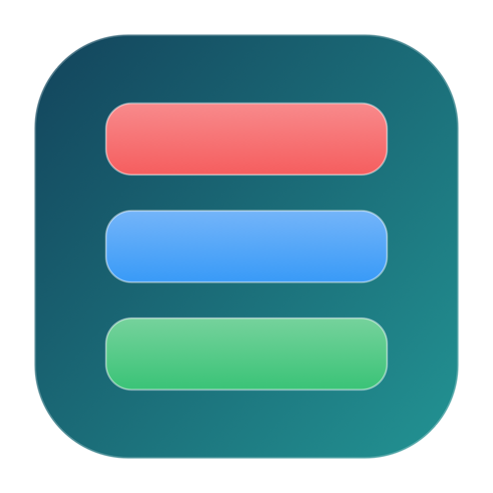

# i-Panel

  

i-Panel, Mac'in menü çubuğunda çalışan küçük bir durum göstergesi ve hızlı kontrol panelidir. Menü çubuğunda macOS'un kendi sade, tek renkli üçlü-kart sembolünü kullanır; yukarıdaki renkli işaret ise Finder, DMG ve proje görselidir.

## Geliştirme notu

i-Panel, proje sahibinin ürün fikri, kapsamı, görsel tercihleri ve gerçek Mac üzerindeki kabul testleri doğrultusunda geliştirildi. Swift/Xcode uygulama kodu, hata ayıklama ve dokümantasyon çalışmaları ise proje sahibinin yönlendirmesiyle **ChatGPT 5.6 Terra (OpenAI Codex)** yapay zekâ geliştirme asistanının desteği kullanılarak birlikte yürütüldü. Proje sahipliği ile tüm ürün ve yayın kararları proje sahibine aittir.

## İndir — 1.3 (Build 4)

[**i-Panel-1.3-build-4-unsigned.dmg dosyasını indir**](https://github.com/enesmisirlioglu0/i-Panel/releases/download/v1.3/i-Panel-1.3-build-4-unsigned.dmg)

- Platform: macOS 13 ve sonrası
- Tek DMG: Apple Silicon ve Intel Mac (`arm64` + `x86_64`)
- Paket: imzasız ve noterlenmemiş public sürüm
- SHA-256: [`i-Panel-1.3-build-4-unsigned.dmg.sha256`](assets/i-Panel-1.3-build-4-unsigned.dmg.sha256)

## Kurulum

1. DMG dosyasını açın.
2. `i-Panel.app` uygulamasını `Applications` bağlantısına sürükleyin.
3. İlk açılışta macOS uyarı gösterirse uygulamaya Finder'da sağ tıklayın, **Aç** seçeneğini seçin ve ardından çıkan **Aç** düğmesine basın.
4. Uygulama Dock'ta görünmeyebilir; üst sağdaki menü çubuğu simgesinden panele ulaşırsınız.

Bu ilk paket Developer ID ile imzalanmış veya noterlenmiş değildir. Bu yüzden Gatekeeper uyarısı beklenir; Gatekeeper'ı kapatmanız gerekmez.

## Neler var?

- Gerçek CPU kullanımı, kullanılan/toplam RAM ve başlangıç diskinin kullanılan/toplam kapasitesi
- Gerçek batarya doluluk yüzdesi ile şarj, adaptör veya batarya kullanım durumu
- Mac toplam anlık indirme ve yükleme hızı
- Batarya sıcaklığı bu sürümde gösterilmez; yalnız güvenilir doluluk ve güç durumu kullanılır
- Anında doğrudan sürükle-bırakla kart sıralama ve `Sıfırla` ile varsayılan sıraya dönüş
- `Ayar` düğmesinden girişte açılma isteği, Dock görünürlüğü, kart sırasını hatırlama ve 1 / 3 / 5 saniyelik yenileme aralığı
- Turkuaz tonlu kompakt panel ve panel dışına tıklanınca yerel macOS davranışıyla kapanma

Tüm gösterge değerleri uygulamanın çalıştığı Mac'te public ve salt okunur macOS API'leriyle ölçülür. i-Panel metrikleri internete göndermez, bulut hesabı kullanmaz, kullanıcı dosyalarını taramaz ve Full Disk Access, Erişilebilirlik veya Yerel Ağ izni istemez. Tercihler yalnızca cihazdaki yerel macOS tercihlerinde saklanır.

İnternet kartı uygulama bazlı değil, Mac'in toplam ağ trafiğini gösterir. VPN veya sanal ağ arayüzleri kullanılırken kapsülleme nedeniyle küçük farklar olabilir. Dahili bataryası olmayan Mac'lerde batarya kartı `Batarya yok` olarak görünür.

## Doğrulama

28 Ağustos 2026'da geliştirici Mac'inde şu kontroller tamamlandı:

- Menü çubuğu simgesinden paneli açma ve kapatma
- `Ayar` düğmesi ve Dock görünürlüğü ayarı
- Kartları doğrudan sürükleyerek sıralama
- `Sıfırla` ile varsayılan kart sırasına dönme
- Universal imzasız Release derlemesi, DMG bütünlük doğrulaması ve DMG içeriği denetimi
- Gerçek metrik sağlayıcısının iki ardışık örnekte CPU, bellek, disk, batarya ve ağ verisini alması
- `1.3 (Build 4)` Info.plist sürümü, `arm64` + `x86_64` evrensel ikili ve uygulama içindeki gizlilik bildirimi denetimi

`Girişte i-Panel’i aç` ayarı macOS'un geçerli uygulama imzası isteyebilen `SMAppService` özelliğine dayanır. Bu nedenle imzasız public pakette bu ayarın çalışması garanti edilmez.

## Kaynak kod

Swift/Xcode kaynakları da artık açıktır: [i-Panel-Source](https://github.com/enesmisirlioglu0/i-Panel-Source). Kaynak kod [MIT Lisansı](https://github.com/enesmisirlioglu0/i-Panel-Source/blob/main/LICENSE) ile kullanılabilir, değiştirilebilir ve dağıtılabilir. İndirme ve sürüm notları ise bu depodaki GitHub Releases alanında tutulur.

## Belgeler

- [Değişiklik kaydı](CHANGELOG.md)
- [Yol haritası](ROADMAP.md)
